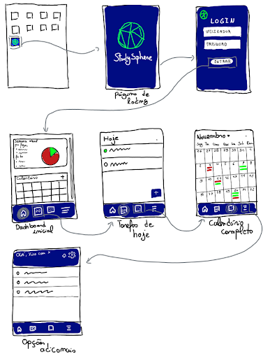
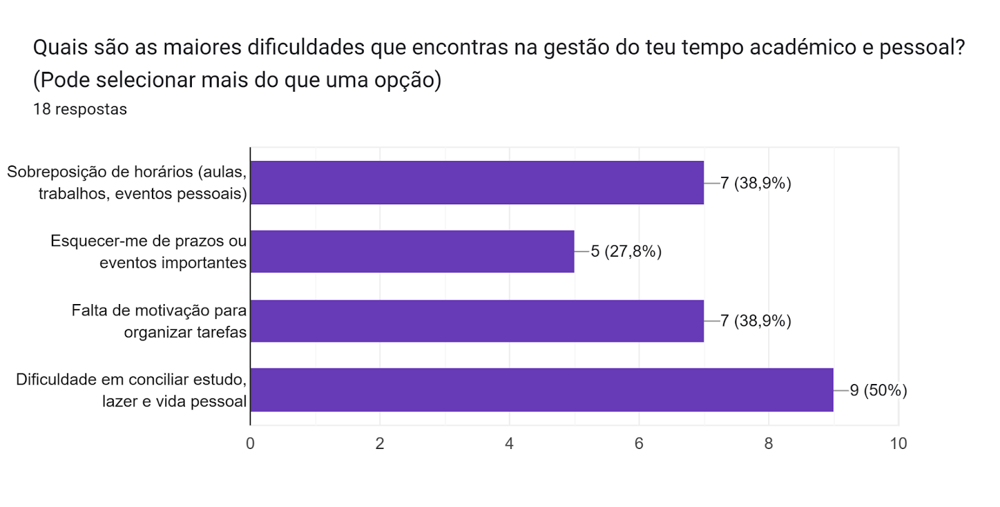
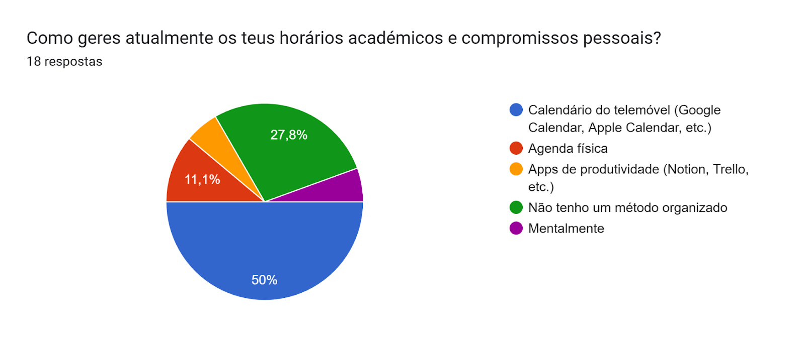
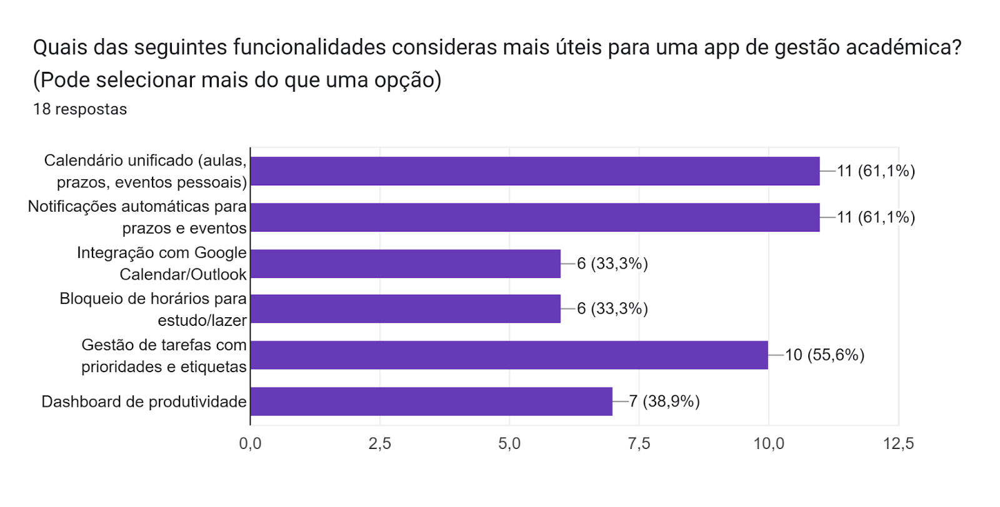

## Indentificação do projeto

Nome: StudySphere

Tema: Aplicação criada para otimizar a organização académica e pessoal de estudantes universitários. 

Membros do grupo:
- Miguel Felgueiras Azevedo Nº:31392
- Francisco José Carvalhosa Fernandes Nº:31432
- Tomás de Sousa e Silva Nº:31373

Curso: Engenharia Informática 

Turma: 3º C

Data: 20/11/2025

Versão: 1.0

Contexto e Motivação
---

A StudySphere ajuda estudantes a gerir o tempo com um calendário unificado de aulas, prazos e compromissos, permitindo criar grupos, partilhar tarefas e eventos, e acompanhar atividades colaborativas.

**Conjunto de Potenciais Utilizadores**

Foi consultado um pequeno grupo de quatro potenciais utilizadores pessoalmente (estudantes) para identificar necessidades reais. Referiram dificuldades em gerir horários, prazos e tarefas dispersas entre várias plataformas, mostrando interesse numa aplicação unificada que simplifique a organização académica e pessoal.

Objetivos da Aplicação
---

A aplicação visa consolidar a gestão de tarefas académicas e pessoais com integração de ferramentas externas como Google Calendar e Outlook de modo a melhorar a produtividade estudantil. A aplicação permite também que estudantes criem e participem em grupos de estudo, partilhem tarefas e eventos, recebam notificações automáticas sobre alterações de colegas e consultem um histórico de atividades colaborativo.

Principais Utilizadores
---

| Tipo de Utilizador   | Descrição  | Principais Ações|
|---|---|---|
|Estudante |Utilizador que organiza as suas tarefas académicas e pessoais e participa de grupos de estudo. |Gere o seu tempo, cria e participa em grupos, partilha tarefas e eventos, recebe notificações sobre atividades do grupo.|

Requisitos Funcionais
---
- Registar e autenticar utilizadores.
- Integrar o horário escolar para ver as aulas que tenho.
- Calendário unificado com aulas, prazos de trabalhos e eventos pessoais.
- Sincronizar opcionalmente o meu calendário Google Calendar ou Outlook.
- Criar grupos de estudo com tarefas e eventos partilhados entre membros.
- Partilhar tarefas dentro de grupos (visualizar, editar, marcar como concluída, comentar).

### Requisitos Funcionais Adicionais

- Receber notificações automáticas para não falhar prazos nem eventos importantes.
- Gerir tarefas com prioridade, estados e etiquetas.
- Suportar comunicação dentro dos grupos através de chat em tempo real, chamadas e partilha de ficheiros.

Requisitos Não Funcionais
---

- Interface intuitiva e acessível para utilizadores com diferentes níveis de experiência tecnológica ou com necessidades especiais.
- Garantir que a app responde rapidamente às interações do utilizador.
- Disponibilidade elevada com tolerância mínima a falhas e recuperação automática.
- Capaz de suportar aumento no número de utilizadores, sem degradação no desempenho.
- Integração com ferramentas externas para otimizar o fluxo de trabalho dos estudantes. 
- Armazenar os dados dos utilizadores de forma segura.
- Assegurar que a app funciona em diferentes versões de sistemas operativos.

Modelo de Informação 
---

### Utilizadores

* **_id**: Identificador único do utilizador (ObjectId).
* **username**: Nome de utilizador único.
* **email**: Endereço de email único.
* **fullName**: Nome completo do utilizador.
* **password**: Palavra-passe (armazenada como hash).
* **avatar**: URL ou caminho para a imagem de perfil.
* **createdAt**: Data de criação do utilizador.
* **externalCalendarId**: ID de sincronização com Google Calendar ou Outlook.
* **eventos**: Lista de eventos criados pelo utilizador.
* **grupos**: Relação com grupos (via tabela intermédia).
* **history**: Registo das ações do utilizador.

### Eventos

* **_id**: Identificador único do evento (ObjectId).
* **title**: Título do evento.
* **description**: Descrição opcional.
* **startDate**: Data e hora de início.
* **endDate**: Data e hora de fim.
* **isVirtual**: Verdadeiro se o evento for virtual.
* **meetingLink**: Link de reunião (se aplicável).
* **priority**: Prioridade do evento (LOW, MEDIUM, HIGH).
* **status**: Estado do evento (scheduled, ongoing, finished, cancelled).
* **owner**: Referência ao utilizador criador.
* **category**: Categoria do evento (academic, work, personal).
* **tags**: Etiquetas associadas.
* **recurrence**: Informação em JSON sobre repetição do evento.
* **externalSync**: Informação de sincronização com calendário externo.
* **eventos**: Relação com grupos (tabela EventoGrupo).
* **createdAt**: Data de criação do evento.

### Grupos

* **_id**: Identificador único do grupo (ObjectId).
* **name**: Nome do grupo.
* **description**: Descrição opcional.
* **members**: Lista de utilizadores associados ao grupo (via GrupoUtilizador).
* **createdAt**: Data de criação do grupo.
* **eventos**: Lista de eventos associados ao grupo.

### EventoGrupo

* **_id**: Identificador único (ObjectId).
* **evento**: Referência ao evento.
* **grupo**: Referência ao grupo.
* **createdAt**: Data de associação.

### GrupoUtilizador

* **_id**: Identificador único (ObjectId).
* **grupo**: Referência ao grupo.
* **utilizador**: Referência ao utilizador.
* **createdAt**: Data de associação.

### Chat

* **_id**: Identificador único (ObjectId).
* **name**: Nome do chat (apenas para chats de grupo).
* **members**: IDs dos utilizadores pertencentes ao chat.
* **type**: Tipo de chat (direct ou group).
* **messages**: Lista de mensagens enviadas.
* **createdAt**: Data de criação.

### Mensagens

* **_id**: Identificador único (ObjectId).
* **chatId**: Referência ao chat.
* **senderId**: Autor da mensagem.
* **content**: Texto da mensagem.
* **timestamp**: Data e hora da mensagem.
* **readBy**: Lista de utilizadores que já leram a mensagem.
* **filePath**: Caminho para ficheiro enviado, se aplicável.

### Histórico de Atividades

* **_id**: Identificador único (ObjectId).
* **user**: Referência ao utilizador.
* **action**: Ação realizada (ex.: "event_created", "joined_group").
* **createdAt**: Data da ação.

Mockups / Wireframes
---

Os mockups foram mostrados a um estudante universitário. O utilizador achou a app fácil de navegar e apreciou a organização clara entre dashboard, tarefas e calendário. O único ponto negativo referido foi que o dashboard parece um pouco cheio, podendo beneficiar de um visual mais simples. No geral, o feedback foi positivo e confirma a utilidade da aplicação.

Validação Inicial
---

Para validar o conceito do StudySphere, foi realizado um questionário dirigido a estudantes, com o objetivo de compreender hábitos de organização, dificuldades e funcionalidades desejadas numa aplicação de gestão académica.

**Principais conclusões do questionário:**

A maioria dos participantes gere os horários através do calendário do telemóvel ou aplicações próprias como o Notion, embora alguns indiquem não ter um método organizado.

As maiores dificuldades identificadas foram esquecer prazos importantes, sobreposição de horários e dificuldade em conciliar estudo, lazer e vida pessoal.

As funcionalidades mais valorizadas pelos utilizadores foram o calendário unificado, notificações automáticas, integração com Google Calendar ou Outlook e gestão de tarefas com prioridades e etiquetas.

Alguns participantes sugeriram que a aplicação fosse simples, intuitiva e com um dashboard mais claro.

O feedback recolhido através do questionário confirmou que existe uma necessidade real de uma aplicação capaz de centralizar horários, prazos e tarefas. As respostas ajudaram a priorizar funcionalidades e validaram a relevância da solução no contexto académico.

</img>

</img>

</img>

Link do questionário: (https://forms.gle/Ue9LrqAc6LFytt968)

Registo de Ferramentas Utilizadas
---

- **ChatGPT** – Apoio na clarificação de requisitos, organização do documento.
- **Google Docs** – Escrita colaborativa e revisão do documento inicial entre os membros do grupo.
- **Visual Studio Code** – Edição do ficheiro em Markdown com melhor formatação e 
pré-visualização.
- **GitHub** - Utilizado para organização do repositório do projeto e do ficheiro da fase 1 e colaboração entre os membros da equipa.
- **Discord** – Comunicação entre os membros do grupo durante esta fase do projeto.